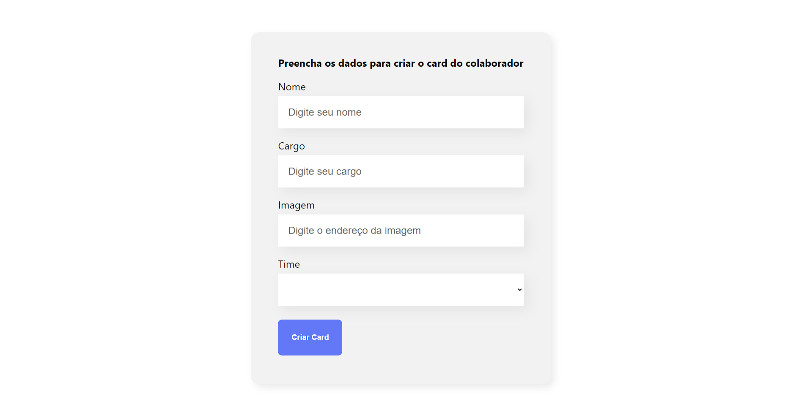

# Projeto Organo React

## Funcionalidades
Este projeto consiste em uma aplicação web desenvolvida com React para gerenciar o cadastro de funcionários em times divididos e estilizados. O objetivo principal foi aprimorar meus conhecimentos em React e explorar seus recursos para criar interfaces dinâmicas e interativas.
## Tecnologias Utilizadas
- HTML: Estruturação da página.
- CSS: Estilização visual.
- JavaScript: Funcionalidades interativas.
- React: Biblioteca JavaScript para criar interfaces de usuário dinâmicas.
## Ferramentas:
- Node.js: Ambiente de execução JavaScript
- npm: Gerenciador de pacotes JavaScript
- Github: Controle de versão de código

  

    

Deploy:

O aplicativo está disponível para teste online no seguinte link: https://projeto-organo-react-rkqr.vercel.app/

Passos a Passo para Utilização:

1. Acesse o link do deploy: https://projeto-organo-react-rkqr.vercel.app/
2. Preencha o formulário com seu nome e cargo.
3. Para adicionar uma foto, utilize o link do seu perfil no GitHub: https://github.com/seu-nome.png, substituindo [seu-nome] pelo seu nome de usuário no GitHub.
4. Selecione o time do qual você faz parte.
5. Clique no botão "Criar Card" e veja seu perfil como membro do time!
